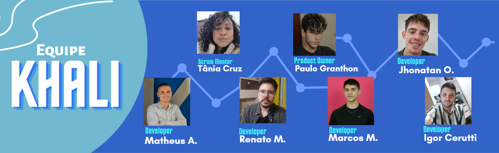
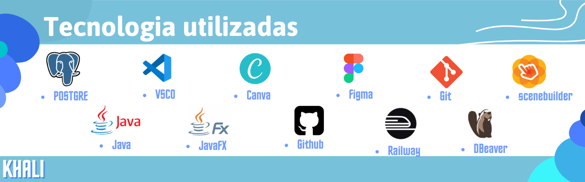

# _**API 2º Semestre - Tecnologia em Banco de Dados 2022**_

## 📍 Sumário
  * [Projeto API](#projeto-api)
    * [Detalhes do projeto](#detalhes-do-projeto)   
  * [Produto Khali](#produto)
    * [Tecnologias e ambientação](#tecnologias-e-ambientação)
    * [Fluxos e manual de utilização](#fluxos-e-manual-de-utilização)
    * [Requisitos do projeto](#requisitos-do-projeto)
    * [Backlog](#backlog)
    * [Entregas](#entregas)

 

# _**Projeto API**_

## **Detalhes do projeto**

 Integrantes da Equipe Khali 

 

| Integrantes | Redes Sociais |
|-------|--------|
|[Igor Cerutti](https://github.com/IgorCeruttiL) |     |
|[Jhonatan Lopes](https://github.com/jhonatanlop) |    |
|[Marcos Malaquias](https://github.com/Incivius) |    |
|[Matheus Almeida](https://github.com/matheusalmsou) |     |
|[Paulo Granthon](https://github.com/paulo-granthon) |    |
|[Renato Mendes](https://github.com/RenatoCMMendes) |     |
|[Tânia Cruz](https://github.com/taniacruzz) |    |

 Tema e objetivos 

 

> * Aplicação desktop simples (CRUD).
> * Os requisitos devem proporcionar uma modelagem de Banco de Dados relacional.
> * A primeira entrega não deve envolver acesso ao Banco de Dados.

 Conhecimentos Exigidos 

 

> * Modelar Banco de Dados relacional
> * Levantar e registrar Requisitos Funcionais e Não Funcionais usando técnicas de Métodos Ágeis e Tradicionais
> * Projetar Arquitetura Lógica do Sistema
> * Implementar Aplicação (com persistência) usando Linguagem de Programação Java Desktop

 Tríade da API 

 

> * Linguagem de programação I, Modelagem e arquitetura de Banco de dados e Laboratório de desenvolvimento de Banco de Dados.

 Prazos 

 

- [x] 13/02 a 03/03 - Kick-off
- [x] 13/03 a 02/04 - Sprint 1
- [x] 03/04 a 23/04 - Sprint 2
- [ ] 24/04 a 14/05 - Sprint 3
- [ ] 15/05 a 04/06 - Sptint 4
- [ ] 13/06 a 14/06 - Feira de soluções

 Burndown 

 

  

# __*Produto*__

## **Tecnologias e ambientação**

 Tecnologias Utilizadas 

  

 Configurando o Ambiente para a Execução do Programa 

 

~~~java
Insira o código aqui: 
~~~

#### Digite em seu terminal os seguintes comandos:

~~~java
Insira o código aqui: 
~~~

 

## **Fluxos e manual de utilização**

 Wireframe do Produto 

> * Fluxo do Usuário Colaborador

https://user-images.githubusercontent.com/79020769/229376542-6ad0b8f7-d61d-47ab-93f5-1e40b159c8b6.mp4

> * Fluxo do Usuário Gestor

https://user-images.githubusercontent.com/79020769/229377143-7fabf142-0ccc-4ced-8f6c-5239deaa65c8.mp4

> * Fluxo do Usuário Administrador

https://user-images.githubusercontent.com/79020769/229377162-bf07ebee-5a1c-4112-8bb1-ec22e0e94deb.mp4

 

> * [Wireframe completo no Figma](https://www.figma.com/file/Dj52xC9ivRB9TjDVtDcgh0/Wireframe_v2?node-id=36-1404&t=OMK6y94PUaXhuzYY-0)

 

 Fluxograma do Produto 

 

[Figma](https://www.figma.com/file/CUEYlQV55LTSTeZUouoDqS/Fluxograma---API---2RP?node-id=1%3A2&t=uiDU6QFHUE06Vi8n-1)

 ERD e Diagrama de Cardinalidade 

 

> 

>   

 Vídeos com Funcionalidades 

https://user-images.githubusercontent.com/79020769/233886119-ace28f22-fccd-45e4-aaa3-85e3d52fce98.mp4

  

 

## **Requisitos do projeto**

 Requisitos Funcionais 

 

> * Usuários devem ter perfis diferentes: administrador (acesso as informações de parametrização,
extração de relatórios e aprovação), gestor (aprovação e lançamento) e colaborador (apontar
horas);
> * Apontamento de horas extras e classificação das horas;
> * Lançamento de horas de sobreaviso;
> * No lançamento da hora extra especificar cliente, CR (centro de resultado), projeto, solicitante e
justificativa;
> * Cadastro de clientes e CRs;
> * Recurso para aprovação de horas extras executadas;
> * Parametrização de sistema (período de fechamento das horas, percentual de classificação das
horas extras e adicional noturno juntamente com as verbas salariais, definição dos horários de
início e fim de horas noturnas);
> * Extração de relatório csv de todos os colaboradores com as horas trabalhadas (matrícula, nome,
verba, quantidade de horas, cliente, CR, projeto, justificativa);
> * Aplicar regras de horas extras e sobreavisos na extração (classificação de HEs e cálculo do
sobreaviso considerando as HEs conflitantes);
> * Dashboard com acompanhamento em tempo real das horas extras executadas com filtro cliente,
CR e colaborador.

 Requisitos não funcionais 

 

> * Linguagem Java (requisito Fatec)
> * Banco de Dados Relacional (requisito Fatec)
> * Documentações

  

## **Backlog**

 SPRINT 2: 

| COMO UM | PRECISO SER CAPAZ DE | PARA | PRIORIDADE |
|---------|----------------------|------|------------|
| Colaborador e Gestor | apontar as minhas horas extras e sobreavisos no sistema | que meu salário seja corretamente calculado. | 1 | 
| Colaborador e Gestor | consultar o meu histórico de apontamentos | acompanhar se foram registradores corretamente. | 2 |
| Gestor | consultar o histórico de apontamentos da(s) minha(s) squad(s) | facilitar o controle dos respectivos horas extras e sobreavisos feitos. | 3 |
| Administrador | acessar os apontamentos de hora extra e sobreaviso de cada colaborador | melhor acompanhamento do respectivo período trabalhado. | 4 |
| Gestor | aprovar ou rejeitar os apontamentos de hora extra e sobreaviso dos colaboradores da(s) minha(s) squad(s) | barrar apontamentos inválidos. | 5 |
| Colaborador | acessar a justificativa fornecida pelo meu gestor caso meu apontamento de hora extra ou sobreaviso seja recusado | que eu possa corrigi-lo. | 6 |
| Colaborador e Gestor | acessar o estado dos meus apontamentos de hora extra e sobreaviso | ser capaz de estimar minha remuneração. | 7 |
| Administrador | visualizar os apontamentos de todos os colaboradores | atender com o que foi combinado com os respectivos clientes. | 8 |

 SPRINT 3: 

 
 | COMO UM | PRECISO SER CAPAZ DE | PARA | PRIORIDADE |
 |---------|----------------------|------|------------|
 | Administrador | cadastrar colaboradores, gestores e administradores | que eu possa designá-los às permissões corretas no sistema. | 1 |
 | Administrador | cadastrar squads incluindo seus respectivos colaboradores e gestor | que os apontamentos sejam corretamente associados aos Centros de Resultado. |  2|
 | Administrador | cadastrar clientes | que sejam referenciados durante o apontamento de horas extras e sobreavisos. | 3 |
 | Administrador | configurar os parâmetros do sistema | que meus colaboradores sejam remunerados corretamente. | 4 |
 | Administrador | gerar relatórios CSV contendo as horas trabalhadas dos meus colaboradores | ter acesso aos dados fora do sistema. | 5 |

 SPRINT 4: 

 
 | COMO UM | PRECISO SER CAPAZ DE | PARA | PRIORIDADE |
 |---------|----------------------|------|------------|
 | Administrador | acessar um Dashboard com informações da jornada de trabalho de todos os meus colaboradores | melhor visualização e tratamento dos dados. | 1 |
 | Colaborador e Gestor | acessar um Dashboard com informações da minha jornada de trabalho | melhor visualização e tratamento dos dados. | 2 |

 

## **Entregas**

 SPRINT 1: Documentação 

> * Fluxograma.  
> * Wireframe.  
> * ERD e Diagrama de Entidade Relacionamento com Cardinalidade. 
> * Backlog por Sprint.
> * Burndown. 

 SPRINT 2: Apontamento de horas, listagem e aprovações 

> * Criação do sistema de apontamento de horas extras e sobreavisos pelos colaboradores e gestores.  
> * Listagem, para colaborador e gestor, dos seus próprios apontamentos.
> * Listagem, para gestor, dos apontamentos lançados pela(s) sua(s) squad(s).
> * Funcionalidade de avaliação dos apontamentos pelo gestor.  
> * Funcionalidade de retorno para colaborador do status do seu apontamento (pendente, aprovado ou reprovado) e feedback. 
> * Funcionalidade de listagem para administrador dos apontamentos de todos os colaboradores.

 SPRINT 3: Cadastro, parametrização e relatório 

> * Sistema de cadastro de colaboradores, gestores e administradores.  
> * Sistema de cadastro de squads.  
> * Sistema de cadastro de clientes.  
> * Funcionalidade de parametrização do sistema.  
> * Funcionalidade de geração de relatórios CSV para o administrador.  

 SPRINT 4: Dashboards 

> * Criação do Dashboard de colaborador.  
> * Criação do Dashboard de gestor.  
> * Criação do Dashboard de administrador.  

